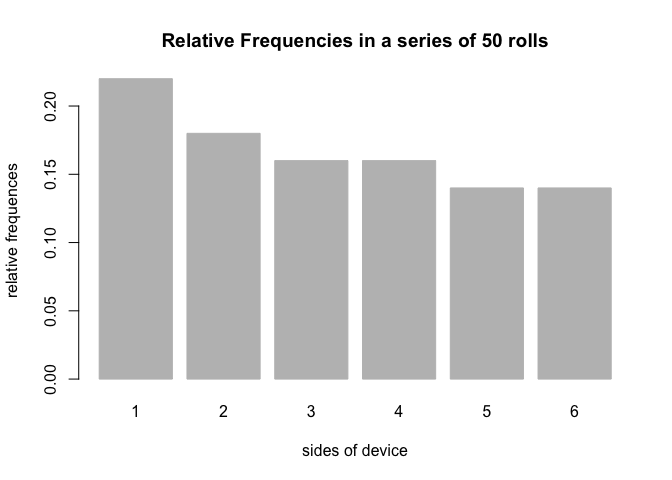

<!-- README.md is generated from README.Rmd. Please edit that file -->
Overview
--------

`"Roller"` is a minimal [R](http://www.r-project.org/) package that provides functions that simulate rolling a device.

-   `device()` creates a device object (of class `"device"`)
-   `roll()` rolls a device object, producing a `"rolls"` object.
-   `plot()` method for a `"rolls"` object to plot the relative frequencies for each side in a simulation.
-   `summary()` method for a `"rolls"` object which outputs the class of the object (`summary.rolls`) and a data frame with the `side`, `count`, and `prop`.

Motivation
----------

This package was created to illustrate how to create a basic R package and to demonstrate core concepts on how an R package works.

Installation
------------

Install the development version from GitHub via the package `"devtools"`:

``` r
# development version from GitHub:
#install.packages("devtools") 
# install "Roller" (without vignettes)
devtools::install_github("hw-stat133-swhui/Roller")
# install "Roller" (with vignettes)
devtools::install_github("hw-stat133-swhui/Roller", build_vignettes = TRUE)
```

Usage
-----

``` r
library(Roller)
# default device
fair_coin <- device()
fair_coin
#> object "device"
#> 
#>   side prob
#> 1    1  0.5
#> 2    2  0.5

# create a device called fair_die with sides, 1 to 6, each with a probability of 1/6
fair_die <- device(sides = 1:6, prob = rep(1/6, 6))
# roll fair_die 50 times
set.seed(123)
fair_50rolls <- roll(fair_die, times = 50)

# print the object
fair_50rolls
#> object "rolls"
#> 
#> $rolls
#>  [1] 3 6 4 1 1 2 5 1 5 4 1 4 6 5 2 1 3 2 3 1 1 6 5 1 5 6 5 5 3 2 1 1 6 6 2
#> [36] 4 6 3 3 3 2 4 4 4 2 2 3 4 3 1

# to display the rolls vector with outputs of the rolls
fair_50rolls$rolls
#>  [1] 3 6 4 1 1 2 5 1 5 4 1 4 6 5 2 1 3 2 3 1 1 6 5 1 5 6 5 5 3 2 1 1 6 6 2
#> [36] 4 6 3 3 3 2 4 4 4 2 2 3 4 3 1

# to display the sides vector with the sides of the `"device"` object
fair_50rolls$sides
#> [1] 1 2 3 4 5 6
  
# to display the prob vector with probabilities for each side of the `"device"` object
fair_50rolls$prob
#> [1] 0.1666667 0.1666667 0.1666667 0.1666667 0.1666667 0.1666667

# to display the total number of rolls
fair_50rolls$total
#> [1] 50

# to display what is in fair_50rolls
names(fair_50rolls)
#> [1] "rolls" "sides" "prob"  "total"

# creates and displays the summary.rolls object for fair_50rolls
obj <- summary(fair_50rolls)

# to display the side column of the `device`
summary(fair_50rolls)$freq$side
#> [1] 1 2 3 4 5 6
# or
obj$freq$side
#> [1] 1 2 3 4 5 6

# to display the count column of the `device`
summary(fair_50rolls)$freq$count
#> [1] 11  8  9  8  7  7

# to display the prop column of the `device`
summary(fair_50rolls)$freq$prop
#> [1] 0.22 0.16 0.18 0.16 0.14 0.14

# to display the names of the `summary.rolls` device, `fair_50rolls`
names(summary(fair_50rolls))
#> [1] "freqs"

# to display the class of fair_50rolls
class(summary(fair_50rolls))
#> [1] "summary.rolls"

# extraction method for fair_50rolls
fair_50rolls[1]
#> [1] 3

# replacement method for fair_50rolls
fair_50rolls[1] <- 2
fair_50rolls[1]
#> [1] 2

# look at the new summary for fair_50rolls
summary(fair_50rolls)
#> summary "rolls"
#> 
#>   side count prop
#> 1    1    11 0.22
#> 2    2     9 0.18
#> 3    3     8 0.16
#> 4    4     8 0.16
#> 5    5     7 0.14
#> 6    6     7 0.14

# adding more rolls to fair_50rolls
fair_70rolls <- fair_50rolls + 20

# display summary of fair_70rolls
summary(fair_70rolls)
#>       Length Class  Mode   
#> rolls 70     -none- numeric
#> sides  6     -none- numeric
#> prob   6     -none- numeric
#> total  1     -none- numeric
```

``` r
# plotting fair_50rolls using the plot method
plot(fair_50rolls)
```


