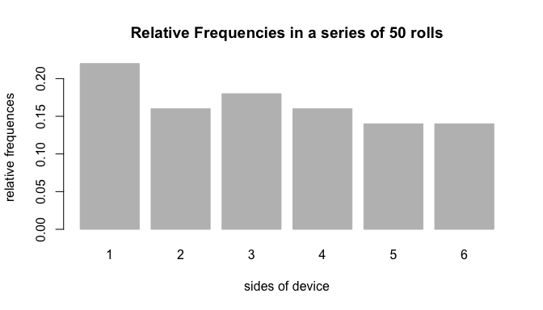
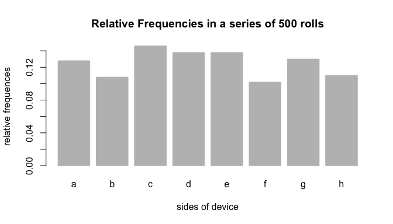

Workout 03 Roller Report
================
Sharon Hui
11/30/2018

About "Roller"
--------------

The following R code chunk is how you will load the package `"Roller"` into R.

``` r
library(Roller)
```

    ## 
    ## Attaching package: 'Roller'

    ## The following object is masked from 'package:base':
    ## 
    ##     summary

The main purpose of this assignment is to create an R package that implements the use of functions to simulate rolling an object such as a coin or die multiple times.

This package includes two classes of objects, which are the following:

1.  the `"device"` to be rolled

2.  the object `"rolls"` (containing the rolls of the `"device"`)

Device Rolling
--------------

The package `"Roller"` is a minimal implementation for simulating rolling a device a given number of times. `"Roller"` can also be used to visualize the relative frequencies in such a series of rolls.

Creating a `device`
-------------------

The first step would be to create a `"device"` object with the function `device()`:

``` r
fair_coin <- device()
fair_coin
```

    ## object "device"
    ## 
    ##   side prob
    ## 1    1  0.5
    ## 2    2  0.5

By default, `device()` creates a *fair* device with standard sides `1`, `2`, and with probability values for `1` to be 0.5 and `2` to be 0.5. Probabilities values must sum up to 1.

You can change the default arguments `sides` and `prob` in the `device()`.

``` r
# one example
weird_die <- device(
  sides = c('i', 'ii', 'iii', 'iv'),
  prob = rep(1/4, 4)
  )
weird_die
```

    ## object "device"
    ## 
    ##   side prob
    ## 1    i 0.25
    ## 2   ii 0.25
    ## 3  iii 0.25
    ## 4   iv 0.25

``` r
# second example
fruit_die <- device(
  sides = c("apples", "bananas", "oranges"),
  prob = c(2/3, 1/6, 1/6)
)
fruit_die
```

    ## object "device"
    ## 
    ##      side      prob
    ## 1  apples 0.6666667
    ## 2 bananas 0.1666667
    ## 3 oranges 0.1666667

Rolling the device
------------------

After you have defined the `"device"` object, you can use the function `roll()` to roll the device a specified number of `times`. The output of `roll()` will be a list with the following four elements:

-   `rolls`: vector with outputs of the rolls
-   `sides`: vector with the sides of the `"device"` object
-   `prob`: vector with probabilities for each side of the `"device"` object
-   `total`: total number of rolls (i.e. `times`)

However, `roll()` will only print the class of the object and the generated `rolls`. In other words, it will display the class of the object (`rolls`) and the rolls. To call/display the other elements such as `sides`, `prob`, and `total`, use `$`.

``` r
# create a device called fair_die with sides, 1 to 6, each with a probability of 1/6
fair_die <- device(sides = 1:6, prob = rep(1/6, 6))
# roll fair_die 50 times
set.seed(123)
fair_50rolls <- roll(fair_die, times = 50)
# print the object
fair_50rolls
```

    ## object "rolls"
    ## 
    ## $rolls
    ##  [1] 3 6 4 1 1 2 5 1 5 4 1 4 6 5 2 1 3 2 3 1 1 6 5 1 5 6 5 5 3 2 1 1 6 6 2
    ## [36] 4 6 3 3 3 2 4 4 4 2 2 3 4 3 1

``` r
# to display the rolls vector with outputs of the rolls
fair_50rolls$rolls
```

    ##  [1] 3 6 4 1 1 2 5 1 5 4 1 4 6 5 2 1 3 2 3 1 1 6 5 1 5 6 5 5 3 2 1 1 6 6 2
    ## [36] 4 6 3 3 3 2 4 4 4 2 2 3 4 3 1

``` r
# to display the sides vector with the sides of the `"device"` object
fair_50rolls$sides
```

    ## [1] 1 2 3 4 5 6

``` r
# to display the prob vector with probabilities for each side of the `"device"` object
fair_50rolls$prob
```

    ## [1] 0.1666667 0.1666667 0.1666667 0.1666667 0.1666667 0.1666667

``` r
# to display the total number of rolls
fair_50rolls$total
```

    ## [1] 50

``` r
# to display what is in fair_50rolls
names(fair_50rolls)
```

    ## [1] "rolls" "sides" "prob"  "total"

``` r
# new example with fruit_die
set.seed(123)
fruit_roll50 <-  roll(fruit_die, times = 50)
# printing the rolls object
fruit_roll50
```

    ## object "rolls"
    ## 
    ## $rolls
    ##  [1] "apples"  "oranges" "apples"  "bananas" "bananas" "apples"  "apples" 
    ##  [8] "bananas" "apples"  "apples"  "bananas" "apples"  "oranges" "apples" 
    ## [15] "apples"  "bananas" "apples"  "apples"  "apples"  "bananas" "bananas"
    ## [22] "oranges" "apples"  "bananas" "apples"  "oranges" "apples"  "apples" 
    ## [29] "apples"  "apples"  "bananas" "bananas" "oranges" "oranges" "apples" 
    ## [36] "apples"  "oranges" "apples"  "apples"  "apples"  "apples"  "apples" 
    ## [43] "apples"  "apples"  "apples"  "apples"  "apples"  "apples"  "apples" 
    ## [50] "bananas"

``` r
# to display the rolls vector with outputs of the rolls
fruit_roll50$rolls
```

    ##  [1] "apples"  "oranges" "apples"  "bananas" "bananas" "apples"  "apples" 
    ##  [8] "bananas" "apples"  "apples"  "bananas" "apples"  "oranges" "apples" 
    ## [15] "apples"  "bananas" "apples"  "apples"  "apples"  "bananas" "bananas"
    ## [22] "oranges" "apples"  "bananas" "apples"  "oranges" "apples"  "apples" 
    ## [29] "apples"  "apples"  "bananas" "bananas" "oranges" "oranges" "apples" 
    ## [36] "apples"  "oranges" "apples"  "apples"  "apples"  "apples"  "apples" 
    ## [43] "apples"  "apples"  "apples"  "apples"  "apples"  "apples"  "apples" 
    ## [50] "bananas"

``` r
# to display the sides vector with the sides of the `"device"` object
fruit_roll50$sides
```

    ## [1] "apples"  "bananas" "oranges"

``` r
# to display the prob vector with probabilities for each side of the `"device"` object
fruit_roll50$prob
```

    ## [1] 0.6666667 0.1666667 0.1666667

``` r
# to display the total number of rolls
fruit_roll50$total
```

    ## [1] 50

``` r
# to display what is in fair_50rolls
names(fruit_roll50)
```

    ## [1] "rolls" "sides" "prob"  "total"

Here is another example of using the rolls.

``` r
# creating a string die device
str_die <- device(
sides = c('a', 'b', 'c', 'd', 'e', 'f'),
prob = c(0.075, 0.1, 0.125, 0.15, 0.20, 0.35))
# roll str_die 20 times
set.seed(123)
str_rolls <- roll(str_die, times = 20)
# print the object
str_rolls
```

    ## object "rolls"
    ## 
    ## $rolls
    ##  [1] "f" "c" "e" "b" "a" "f" "e" "b" "d" "e" "a" "e" "d" "d" "f" "b" "f"
    ## [18] "f" "f" "a"

``` r
# to display the rolls vector with outputs of the rolls
str_rolls$rolls
```

    ##  [1] "f" "c" "e" "b" "a" "f" "e" "b" "d" "e" "a" "e" "d" "d" "f" "b" "f"
    ## [18] "f" "f" "a"

``` r
# to display the sides vector with the sides of the `"device"` object
str_rolls$sides
```

    ## [1] "a" "b" "c" "d" "e" "f"

``` r
# to display the prob vector with probabilities for each side of the `"device"` object
str_rolls$prob
```

    ## [1] 0.075 0.100 0.125 0.150 0.200 0.350

``` r
# to display the total number of rolls
str_rolls$total
```

    ## [1] 20

``` r
# to display what is in fair_50rolls
names(str_rolls)
```

    ## [1] "rolls" "sides" "prob"  "total"

The `summary()` function for rolls also gives you a table of frequencies including the side (`side`), count (`count`), and proportion (`prop`). The summary method returns an object, `"summary.rolls"` and the otput wil be a list containing a data frame called `freqs` with the three columns, `side`, `count`, and `prop`.

-   The `side` column gives the sides of the rolled `device`.
-   The `count` column gives the frequency (count) of each side of the rolled device.
-   The `prop` column gives the relative frequency (proportion) of each side of the rolled `device`.

``` r
# creates the summary.rolls object for str_rolls
summary(str_rolls)
```

    ## summary "rolls"
    ## 
    ##   side count prop
    ## 1    a     3 0.15
    ## 2    b     3 0.15
    ## 3    c     1 0.05
    ## 4    d     3 0.15
    ## 5    e     4 0.20
    ## 6    f     6 0.30

``` r
# to display the side column of the `device`
summary(str_rolls)$freq$side
```

    ## [1] a b c d e f
    ## Levels: a b c d e f

``` r
# to display the count column of the `device`
summary(str_rolls)$freq$count
```

    ## [1] 3 3 1 3 4 6

``` r
# to display the prop column of the `device`
summary(str_rolls)$freq$prop
```

    ## [1] 0.15 0.15 0.05 0.15 0.20 0.30

``` r
# to display the names of the `summary.rolls` device, `str_rolls`
names(summary(str_rolls))
```

    ## [1] "freqs"

``` r
# to display the class of str_rolls
class(summary(str_rolls))
```

    ## [1] "summary.rolls"

More Functions for the Object `"rolls"`
---------------------------------------

You can use the `"["` to extract the value of the given roll. This is an extraction method.

``` r
# roll fair 8-sided die
set.seed(123)
fair_dev <- device(sides = letters[1:8], prob = rep(1/8, 8))
fair500 <- roll(fair_dev, times = 500)
# summary method
summary(fair500)
```

    ## summary "rolls"
    ## 
    ##   side count  prop
    ## 1    a    63 0.126
    ## 2    b    54 0.108
    ## 3    c    73 0.146
    ## 4    d    69 0.138
    ## 5    e    69 0.138
    ## 6    f    51 0.102
    ## 7    g    65 0.130
    ## 8    h    56 0.112

``` r
# extracting the roll in position 500
fair500[500]
```

    ## [1] "h"

You can use the `"[<-"`to replace the value of a given roll. This is an replacement method.

``` r
# replacing a roll in position 500
fair500[500] <- 'a'
fair500[500]
```

    ## [1] "a"

This will change the summary of `fair500`.

``` r
# look at the new summary for fair 500
summary(fair500)
```

    ## summary "rolls"
    ## 
    ##   side count  prop
    ## 1    a    64 0.128
    ## 2    b    54 0.108
    ## 3    c    73 0.146
    ## 4    d    69 0.138
    ## 5    e    69 0.138
    ## 6    f    51 0.102
    ## 7    g    65 0.130
    ## 8    h    55 0.110

You can use the `"+"` to add more rolls. This is an addition method.

``` r
# adding 100 rolls
fair600 <- fair500 + 100
# this is the summary of fair600
summary(fair600)
```

    ## summary "rolls"
    ## 
    ##   side count   prop
    ## 1    a    79 0.1317
    ## 2    b    69 0.1150
    ## 3    c    78 0.1300
    ## 4    d    85 0.1417
    ## 5    e    78 0.1300
    ## 6    f    67 0.1117
    ## 7    g    74 0.1233
    ## 8    h    70 0.1167

Plotting Counts and Relative Frequencies of Rolls
-------------------------------------------------

You can use the function `plot()` to create a graohic with the relative frequencies of a series of device rolls:

``` r
# plotting fair_50rolls using the plot method
plot(fair_50rolls)
```



``` r
# plotting fair500 using the plot method
plot(fair500, 500)
```


