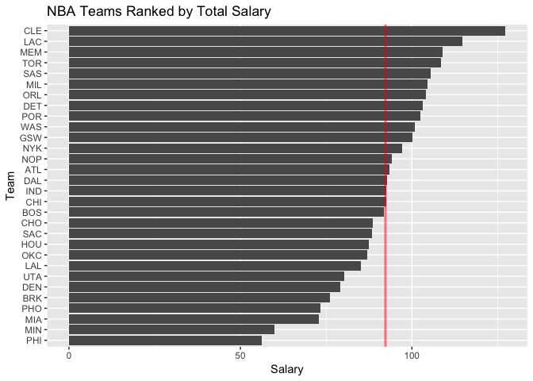
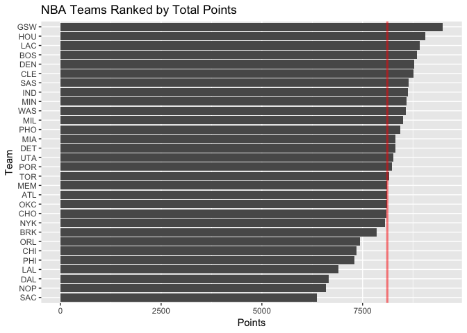
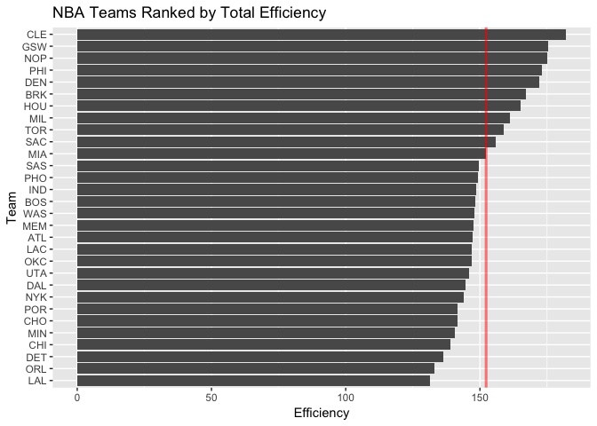
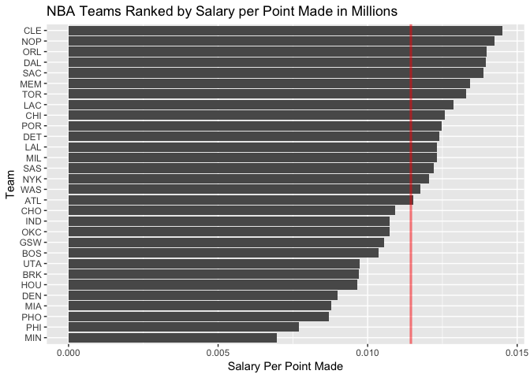

Workout 1 - Data Wrangling and Visualization
================
Sharon Hui
9/28/2018

From the logistical point of view, we will work with `data.frames`/`tibbles` and producing plots but now using the packages "`dyplyr`" and "`ggplot2`". We will have to upload all the files to your Github Class Repository.

Motivation

In this assignment, we will consider difference ways to rank NBA teams based on a given observed variable or derived indices.

#### 1) File Structure

-   Create a folder (i.e. subdirectory) `workout1` in your `stat133-hws-fall18` local repository. This is where you will save all the associated files for this assignment.

-   Create a `README.md` file.

-   Create a folder `data` which will contain the data files.

-   Create a folder `code` which will contain an `R` script file.

-   Create a folder `output` which will contain some `R` outputs.

-   Create a folder `report` which will contain the files for your dynamic document.

-   In the yaml header of the `Rmd` file, set the output field as output: `github_document`. (Do NOT use the default "`output: html_document`").

-   No html files will be taken into account (no exceptions).

-   Name this file as `workout01-first-last.Rmd`, where first and last are your first and last names (e.g. `workout01-gaston-sanchez.Rmd`).

-   Please do not use code chunk options such as: `echo = FALSE`, `eval = FALSE`, `results = 'hide'`. All chunks must be visible and evaluated.

-   Use Git to *add* and *commit* the changes as you progress with your HW.

-   And don’t forget to *push* your commits to your github repository; you should push the Rmd and md files, as well as the generated folder and files containing the plot images.

-   **Submit the link of your repository to bCourses. Do NOT submit any files (we will actually turn off the uploading files option).**

I used to following commands in the command line. While I understand that I should not use `eval = FALSE`, in order to display the codes that I used in the terminal in an R chunk, I will need to use `eval = FALSE`.

``` r
cd Desktop
cd hw-stat133
mkdir workout1
cd workout1
touch README.md
mkdir data
mkdir code
mkdir output
mkdir report
```

##### Download the data

``` r
curl -O https://raw.githubusercontent.com/ucb-stat133/stat133-fall-2018/master/data/nba2018.csv
mv nba2018.csv data
```

#### 2) Create a README.md File

Create a README.md file and include a description of what the HW is about. If this is your first time creating this type of file, and you are not sure about what to include, then think in your future self. Picture yourself 6 months later (or one year later) and coming back to see what you did for this assignment. What things would you like to see in the `README` file in order to refresh your memory? Another suggestion is to think of a potential user/reader that looks at your work. What would you like to tell me in case they quickly inspect this assignment and the first thing they look at is the README file?

For this part, I added my description and goals of this workout in the README file, which is located in the workout01 directory.

#### 3) Create a data dictionary

As we saw in lecture, in addition to having a text file for the data table, there should also be a file with the data dictionary describing various details about the contents of the data file. For instance, things like:

-   what is the data about?

-   how many rows?

-   how many columns?

-   what are the column labels?

-   if the column names are abbreviations, what is the full description of each column?

-   what are the units of measurement (e.g. inches, pounds, km/h, etc)?

-   how missing values are codified?

``` r
cd Desktop
cd stat133-hws-fall18/workout1
touch data/nba2018-dictionary.md
open data/nba2018-dictionary.md
```

#### 4) Data Preparation

The primary goal of this stage is to create a `.csv` data file `nba2018-teams.csv` that will contain the required variables to be used in the ranking analysis.

All the R code to complete the data preparation stage must be written in an .R script file (do NOT confuse with an `Rmd` file). Name the R script file as `make-teams-table.R` and save it inside the code/ folder. Include a header (but NOT a yaml header) in the file containing:

-   title: short title

-   description: a short description of what the script is about

-   input(s): what are the inputs required by the script?

-   output(s): what are the outputs created when running the script?

I will include the code that I wrote in `make-teams-table.R` here.

``` r
##################################################
## title: NBA 2018 Data Preparation
## description: Table of NBA 2018 teams
## input(s): nba2018-teams.csv data
## output(s): nba2018-teams.csv data, efficiency-summary.txt, teams-summary.txt
##################################################
### Data Preparation for nba2018-teams.csv

#### Description
# In this script, I will preprocess solumns `salary`, `experience`, and `position`. 
# I will change `experience` by replacing all of the `"R"` 
# with 0 and then convert the entire column into integers.
# I will tranform `salary` so that I have salaries in millions.
# I will relabel `position` into a factor with more descriptive names.
# They will be `center` instead of `C`, `power_fwd` 
# instead of `PF`, `point_guard` instead of `PG`, `small_fwd` 
# instead of `SF`, and `shoot_guard` instead of `SG`.
# 
# I will also add new variables such as the following:
#  - `missed_fg` = missed field goals 
#  - `missed_ft` = missed free throws 
#  - `rebounds` = offensive rebounds + defensive rebounds 
#  - `efficiency` = efficiency index
# 
# I will also use `sink()` to send the R output of `summary()` 
# on `efficiency`. Then, we will use data aggregation, which 
# is grouping by operations to create nba2018-teams.csv , 
# a data frame for teams and use sink to create a summary of the 
# teams and a .csv file.
# 
# 


# A bit of preprocessing
setwd("/Users/sharonhui/Desktop/hw-stat133/workout1/data")
nba <-read.csv("../data/nba2018.csv", header = TRUE, 
               stringsAsFactors = FALSE)
nba$experience <- as.character(nba$experience)
nba$experience[nba$experience == "R"] <- 0
nba$experience <- as.integer(nba$experience)
nba$salary <- nba$salary/1000000
levels(nba$position)
levels(nba$position) <- c("center", 
                          "power_fwd", 
                          "point_guard", 
                          "small_fwd", 
                          "shoot_guard")
# Adding new variables
library(dplyr)
nba <- mutate(nba, missed_fg = (field_goals_atts - field_goals), 
              missed_ft = (points1_atts - points1), 
              rebounds = (off_rebounds + def_rebounds), 
              efficiency = ((points + rebounds + assists + steals + blocks - missed_fg - missed_ft - turnovers))/games)

sink(file = "../output/efficiency-summary.txt")
summary(nba$efficiency)
sink()

### Creating nba2018-teams.csv
# With your updated data frame you will do some data aggregation—or 
# grouped by operations— to create a data frame teams, computing total values, 
# for each team, of the following required variables: 
#  - team: 3-letter team abbreviation 
#  - experience: sum of years of experience (up to 2 decimal digits) 
#  - salary: total salary (in millions, up to 2 decimal digits) 
#  - points3: total 3-Point Field Goals 
#  - points2: total 2-Point Field Goals
#  - points1: total free throws 
#  - points: total Points 
#  - off_rebounds: total Offensive Rebounds 
#  - def_rebounds: total Defensive Rebounds 
#  - assists: total Assists 
#  - steals: total Steals 
#  - blocks: total Blocks 
#  - turnovers: total Turnovers 
#  - fouls: total fouls 
#  - efficiency: total efficiency
teams <- data.frame(summarize((group_by(nba, team)), 
                              experience = sum(experience),
                   salary = sum(salary),
                   points3 = sum(points3),
                   points2 = sum(points2),
                   points1 = sum(points1),
                   points  = sum(points),
                   off_rebounds = sum(off_rebounds),
                   def_rebounds = sum(def_rebounds),
                   assists = sum(assists),
                   steals = sum(steals),
                   blocks = sum(blocks),
                   turnovers = sum(turnovers),
                   fouls = sum(fouls),
                   efficiency = sum(efficiency)
                   ))
sink(file = "../output/teams-summary.txt")
summary(teams)
sink()


write.csv(teams, file = "../data/nba2018-teams.csv")
```

``` r
touch code/make-teams-table.R
open code/make-teams-table.R
```

#### 5) Ranking of Teams

-   Start by ranking the teams according to salary, arranged in decreasing order. Use `ggplot()` to create a barchart (horizontally oriented), like the one shown below. By the way, the figure below is based on data from 2016 (the graph you obtain will likely be different). The vertical red line is the average total salary.

``` r
teams <- read.csv("../data/nba2018-teams.csv")
library(ggplot2)
```

    ## Warning: package 'ggplot2' was built under R version 3.4.4

``` r
ggplot(data = teams, aes(x = reorder(team, salary), y = salary)) + 
  geom_bar(stat = "identity") + 
  coord_flip() + xlab("Team") + 
  ylab("Salary") + 
  ggtitle("NBA Teams Ranked by Total Salary", subtitle = NULL) + 
  geom_hline(yintercept = mean(teams$salary), color = "red", size = 1.1, alpha = .5)
```



-   Create another bar chart of teams ranked by total points. Include a vertical line to indicate the average team points.

``` r
ggplot(data = teams, aes(x = reorder(team, points), y = points)) +
  geom_bar(stat = "identity") + 
  coord_flip() + xlab("Team") + 
  ylab("Points") + 
  ggtitle("NBA Teams Ranked by Total Points", 
          subtitle = NULL) + 
  geom_hline(yintercept = mean(teams$points), color = "red", size = 1.1, alpha = .5)
```



-   Use `efficiency` to obtain a third kind of ranking, and create an associated bar chart of teams ranked by total efficiency. Include a vertical line to indicate the average team efficiency.

``` r
ggplot(data = teams, aes(x = reorder(team, efficiency), y = efficiency)) + 
  geom_bar(stat = "identity") + 
  coord_flip() + xlab("Team") + 
  ylab("Efficiency") + 
  ggtitle("NBA Teams Ranked by Total Efficiency", 
          subtitle = NULL) + 
  geom_hline(yintercept = mean(teams$efficiency), color = "red", size = 1.1, alpha = .5)
```



-   Create a fourth bar chart but this time using your own index. In other words, if you had to come up with your own index (e.g. your own efficiency index or something like that), how 7 would you calculate it? Explain your rationale behind your own index. And then use it to graph the barchart.

Some teams may be more popular than others, so for every point that a team makes, the amount of money the team gets could be more than another team. While the teams have the same job, some teams will never make as much money as other because of the market where they are located at. Most NBA teams make money off their local TV deals, merchandise, game seats, and other advertisements. The more successful a team is in a game (meaning that they more points), the more recognized they are and more people will want to see them or will admire them. The more popular a team is based on how many points they are able to obtain in a single game, and they will get more sponsorships if they obtain a good reputation in the people's eyes. The more coveted the players are, the more they can charge fans for tickets to see their games. If a team is more popular than another team, then fans are more likely to be willing to pay more to watch their games. Once a team obtains a good reputation, more people are willing to pay for their tickets, merchandise, and the products associated with the team, allowing for the team to make a larger salary. Here we will rank teams based on how much money a team makes when they score a point. I created this barchart to see who makes the most money per point made and see how how different these numbers are based on the different teams.

``` r
salaryperpointmade <- (teams$salary/teams$points)
ggplot(data = teams, aes(x = reorder(team, salaryperpointmade),
                         y = salaryperpointmade)) + 
  geom_bar(stat = "identity") + 
  coord_flip() + xlab("Team") + 
  ylab("Salary Per Point Made") + 
  ggtitle("NBA Teams Ranked by Salary per Point Made in Millions", 
          subtitle = NULL) + 
  geom_hline(yintercept = mean(salaryperpointmade), color = "red", size = 1.1, alpha = .5)
```



#### Comments and Reflections

In your Rmd report include a section to reflect on what was hard/easy, problems you solved, helpful tutorials you read, etc.

Was this your first time working on a project with such file structure? If yes, how do you feel about it? Was this your first time using relative paths? If yes, can you tell why they are important for reproducibility purposes? Was this your first time using an R script? If yes, what do you think about just writing code (without markdown syntax)? What things were hard, even though you saw them in class/lab? What was easy(-ish) even though we haven’t done it in class/lab? Did anyone help you completing the assignment? If so, who? How much time did it take to complete this HW? What was the most time consuming part? Was there anything interesting?

-   This is my first time working on a project with such file structure.

-   Understanding how to do certain commands such creating a horizontal bar chart with the red line for the mean was difficult to understand since we had learned that part recently.

-   Overall, I believe that my first time working on a project with such a file structure was eye-opening and greatly helped me apply what I had learned in lecture about data visualization.

-   This was not my first time using relative paths since we have seen this in class and also in Statistics 20. However, using them in class was a great way for me to understand what R is doing with the code.

-   The relative path is the patch from the root directory to the file that I want and include ".." which means to go to the parent directory of the current directory. Since relative paths only relies on part of the directory structure being the same, people can share codes along with relevant file structure and the code will still work.

-   While this was not my first time using an R script, I find that writing code (without markdown syntax) looks rather messy. In order to write code that will not be evaluated, I need to use `"#"` often.

-   One thing that was fairly easy was creating the .csv file because all we had to understand was how to use `sink()`, and we were able to apply our previous knowledge to create our own data frame.

-   I needed some help fromt the GSI for clarification on the instructions, but for the most part, I did not need help.

-   It took about 10 hours to finish completing the lab since I was also reviewing previous material that we had learned and took the time to read the instructions and understand my code.

-   The most time-consuming part was creating the data dictionary, since we had never created such a file before. I was not entirely sure what we should have put on the file, so I looked at what the professor did on his data dictionary files on Github.

-   The most interesting part was creating the bar charts, since we were able to create our own index and make sense out of the data and rank the teams based on our own index.
